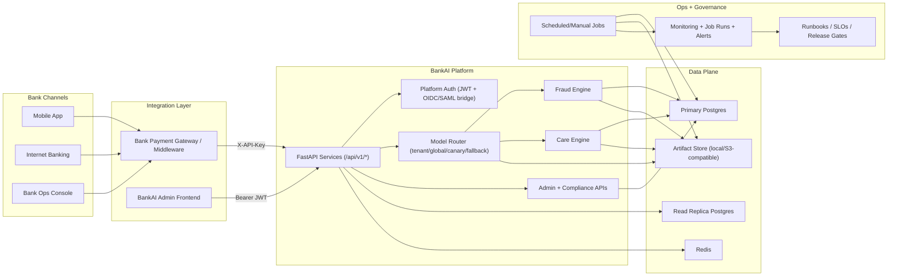

# System Architecture Diagram (Bank-Level)

## Clean Architecture View

## What This Means (Non-Technical)

- Bank channels send transactions through the bank gateway to BankAI.
- BankAI decides risk in real time using tenant-specific routing and models.
- Core records live in Postgres; heavy reads can go to a replica.
- Model files are stored in artifact storage (not inside DB rows).
- Governance jobs continuously protect quality (guardrails, challenger checks, retention/export controls).
